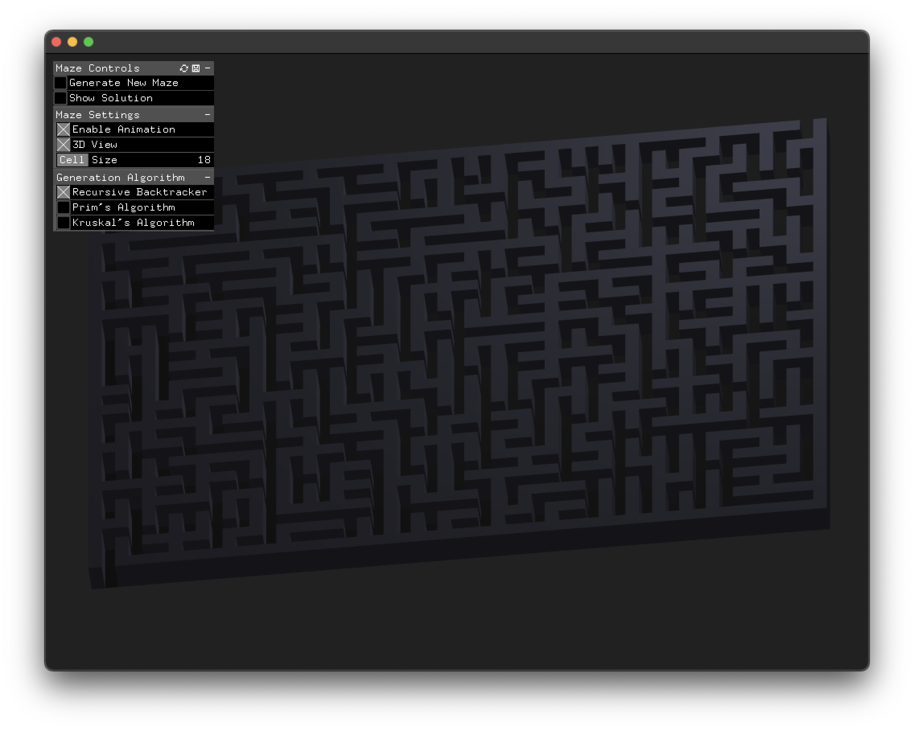

# MazeGenerator

An interactive maze generator and solver built with OpenFrameworks. Create, visualize, and solve mazes in real-time with multiple generation algorithms and visualization options.



## Features

- Interactive maze generation and solving
- Multiple generation algorithms:
  - Recursive Backtracker
  - Prim's Algorithm
  - Kruskal's Algorithm
- Real-time animation of maze generation and solution
- 2D and 3D visualization modes
- Adjustable maze cell size
- Dynamic maze resizing based on window size
- GUI controls for all features
- Automatic path finding with animated solution display

## Controls

- **Space**: Generate new maze instantly
- **G**: Toggle animated generation
- **F**: Toggle animated solution
- **S**: Toggle solution visibility
- **H**: Toggle GUI visibility
- **+/-**: Increase/decrease cell size

## Installation

1. Download and install [OpenFrameworks](https://openframeworks.cc/download/)
2. Clone this repository into your OpenFrameworks apps folder:
   ```bash
   cd openFrameworks/apps/myApps
   git clone https://github.com/vessovit/MazeGenerator.git
   ```
3. Use the OpenFrameworks Project Generator to create the project files
4. Add the required addon: ofxGui

## Building

### macOS
1. Open the Xcode project in `MazeGenerator.xcodeproj`
2. Build and run the project in Xcode

### Linux
```bash
make
make RunRelease
```

### Windows
1. Open the Visual Studio solution
2. Build and run the project

## Dependencies

- OpenFrameworks 0.12.0 or later
- ofxGui addon

## License

This project is licensed under the MIT License - see the LICENSE file for details.

## Contributing

1. Fork the repository
2. Create your feature branch (`git checkout -b feature/amazing-feature`)
3. Commit your changes (`git commit -m 'Add some amazing feature'`)
4. Push to the branch (`git push origin feature/amazing-feature`)
5. Open a Pull Request

## Authors

- Vesso Vit - Initial work

## Acknowledgments

- OpenFrameworks community
- Maze generation algorithms based on research by Jamis Buck
